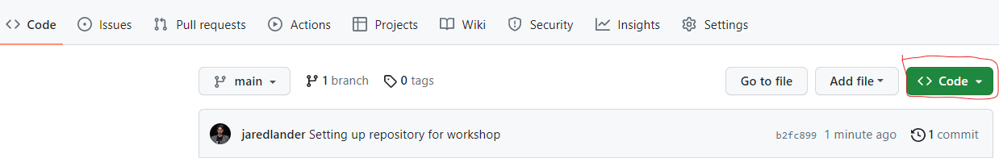
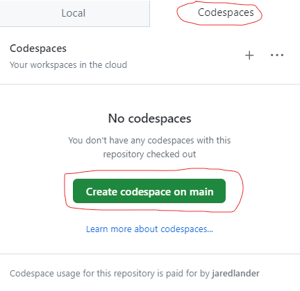

# IRS R Training 2024
## Forecasting in R


- [IRS R Training 2024](#irs-r-training-2024)
  - [Setup](#setup)
  - [Project Structure](#project-structure)
    - [Git](#git)
    - [Docker](#docker)
    - [Codespaces](#codespaces)
    - [RStudio Cloud](#rstudio-cloud)
  - [Class Plan](#class-plan)
    - [Machine Learning in R Part I](#machine-learning-in-r-part-i)
    - [Machine Learning in R Part II](#machine-learning-in-r-part-ii)
    - [Git and GitLab](#git-and-gitlab)
    - [Workflow & Visualization in R](#workflow--visualization-in-r)
    - [Computing in R](#computing-in-r)
    - [Forecasting in R](#forecasting-in-r----this-class)
    - [High Performance Computing in
      R](#high-performance-computing-in-r)
  - [Instructor Bios](#instructor-bios)
    - [Jared P. Lander](#jared-p-lander)
    - [Joe Marlo](#joe-marlo)
    - [Gus Lipkin](#gus-lipkin)

<!-- README.md is generated from README.Rmd. Please edit that file -->

# IRS R Training 2024

<!-- badges: start -->
<!-- badges: end -->

Welcome to IRS R Training 2024 at [Lander Analytics](https://landeranalytics.com). This repo has information to properly setup your environment.

## Setup

For this course you need a recent version of R. Anything greater than 4.1 is good but 4.4.0 is even better. I also highly recommend using your IDE/code editor of choice. Most people use either [RStudio](https://www.rstudio.com/products/rstudio/) or [VS Code](https://code.visualstudio.com/) with [R Language Extensions](https://code.visualstudio.com/docs/languages/r).

After you have R and your favorite editor installed, you should install the packages needed for this class with the following line of code. You can copy and paste it into the R console.

<div class="wrapMe sourceCode r">

    install.packages(c('ggplot2', 'dplyr', 'tidyr', 'purrr'))

</div>

## Project Structure

To make your life easier, you should have a folder for just this class, you could call it `r_class`. The structure should look like this.

    .
    ├── code
    │   └── code.md
    ├── data
    │   └── data.md
    ├── slides
    │   └── slides.md
    └── irs2024fall-fc.Rproj

All the code you write will go in the `code` folder within this folder. And all of the data files will go in the `data` folder.

You can either create it yourself or follow one (**and only one**) of the methods below.

### Git

If you are comfortable with git, you can clone this repo and the project structure will be all set for you.

``` sh
git clone https://github.com/landeranalytics/irs2024fall-fc.git
```

This includes the `{renv}` lock file, so you can install all the packages with the following R code.

``` r
renv::restore(repos=c('https://packagemanager.posit.co/cran/latest'))
```

### Codespaces

The Docker image should work natively in [GitHub Codespaces](https://github.com/features/codespaces) so you can run a remote instance of VS Code with all the packages ready to go. You can theoretically even launch RStudio from within the VS Code instance, though I haven’t figured that out yet.

To launch Codespaces, first click the green `Code` button at the top of this page.



Then click where it says `Codespaces` then the green `Create codespaces on main` button.



This will open an instance of VS Code in the browser that will give you R, all the packages and even the code we write during this workshop. You can even attach to this image from VS Code on your own computer.

Be sure to stop the codespace when you are done so you do not get charged.

### Posit Cloud

If you are still having trouble setting up the project and getting everything installed, sign up for an [Posit.cloud](https://posit.cloud/) account.

## Class Plan

This is the general plan for the class.

### Machine Learning in R Part I

- *Date*: Wednesday, September 4
- *Instructor*: Jared P. Lander

### Machine Learning in R Part II

- *Date*: Wednesday, September 11
- *Instructor*: Jared P. Lander

### Git and GitLab

- *Date*: Monday, September 23
- *Instructor*: Gus Lipkin and Joe Marlo

### Workflow & Visualization in R

- *Date*: Wednesday, September 25
- *Instructor*: Joe Marlo

### Computing in R 

- *Date*: Monday, October 7
- *Instructor*: Joe Marlo and Gus Lipkin

### Forecasting in R -- THIS CLASS

- *Date*: Wednesday, October 9
- *Instructor*: Joe Marlo

### High Performance Computing in R

- *Date*: Thursday, October 17
- *Instructor*: Jared P. Lander

## Instructor Bios

### Jared P. Lander

Jared P. Lander is Chief Data Scientist of [Lander Analytics](https://www.landeranalytics.com), the Organizer of the [New York Open Statistical Programming Meetup](https://www.nyhackr.org) and the [New York R](https://rstats.ai/nyc) and [R in Government](https://rstats.ai/gov) Conferences, an Adjunct Professor at [Columbia Business School](https://business.columbia.edu/), and a Visiting Lecturer at [Princeton University](https://princeton.edu/). With a masters from [Columbia University](https://www.columbia.edu) in
statistics and a bachelors from [Muhlenberg College](https://www.muhlenberg.edu) in mathematics, he has experience in both academic research and industry. He is the author of [R for Everyone](https://amzn.to/4e1Q6HI) (now in its second edition), a book about R Programming geared toward Data Scientists and Non-Statisticians alike and a Series Editor for his publisher, Pearson. Additionally, he is an [R Consortium Board Member](https://www.r-consortium.org/). Very active in the data community, Jared is a frequent speaker at conferences, universities and meetups around the world. His writings on statistics can be found at [jaredlander.com](https://jaredlander.com) and his work has been featured in publications such as [Forbes](https://www.forbes.com/sites/prishe/2017/03/07/reflections-from-the-2017-mit-sports-analytics-conference/#1a95a3473f75) and the [Wall Street Journal](https://www.wsj.com/articles/a-data-scientist-dissects-the-2016-nfl-draft-1461793878).

### Joe Marlo

Joe Marlo is the Director of Data Science focused on statistics, Shiny, and R programming. He’s authored multiple R packages on sequence analysis and causal inference diagnostics. Previously, he was a quantitative strategist at J.P. Morgan and a data scientist at Verizon. The former role leveraged proprietary big data to understand the spending and saving patterns of Americans and the latter role hierarchical forecasting problems. He holds a master’s in applied statistics from New York University and a bachelor’s in finance from University of Missouri. Joe is also an assistant research scientist at New York University where he works on thinkCausal, a project to make machine learning methods for causal inference more accessible.

### Gus Lipkin

Gus Lipkin is a Data Scientist at Lander Analytics. Prior to joining the team, he spent a year as a Data Analyst at Publix Super Markets where he focused on creating fully automated reporting pipelines, linking disparate data, and creating an R package to help optimize product mixes for any group of items. Gus earned his Bachelor’s of Science in Business Analytics with concentrations in Quantitative Economics & Econometrics and Intelligent Mobility from Florida Polytechnic University where his Capstone project team won the Showcase Award. He lives in Florida with his two cats, enjoys spending time outdoors when it’s not too hot, and plays Bananagrams and eats lots of coffee ice cream when it is.
